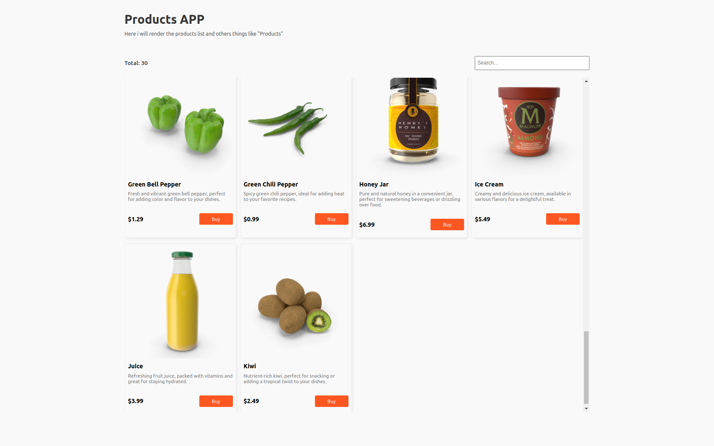

# Micro Frontend - Module Federation



Este projeto demonstra uma aplicação de micro frontends onde temos três aplicativos independentes: **`react-components`**,**`vue-components`** e **`app`**. 

- **`react-components`**: Fornece os componentes React reutilizáveis para exibição de produtos.
- **`app`**: Utiliza os componentes do `react-components` e do `vue-components` para mostrar uma lista de produtos na tela.
- **`vue-components`**: footer desenvolvido com Vue

## Estrutura do Projeto

```
/micro-frontend-app
  ├── /app        
  ├── /react-components
  ├── /vue-components
  ├── package.json        
  └── README.md 
```

## Instalação

### Clonar o Repositório
```bash
git clone https://github.com/manuelbento19/micro-frontend.git
cd micro-frontend
```

### Instalar Dependências

Navegue até o diretório de **`react-components`** e instale as dependências:
```bash
cd react-components
npm install
```

Navegue até o diretório de **`app`** e instale as dependências:
```bash
cd ../app
npm install
```
Navegue até o diretório de **`vue-components`** e instale as dependências:
```bash
cd ../vue-components
npm install
```
## Excecutar

Para iniciar o ambiente, você precisa rodar o **`react-components`**, o **`app`** e o **`vue-components`** em paralelo.

**`react-components`**:
   ```bash
   cd react-components
   npm run preview
   ```
Em um novo terminal, **`vue-components`**:
   ```bash
   cd vue-components
   npm run dev
   ```
Em um novo terminal, **`app`**:
   ```bash
   cd app
   npm run dev
   ```

### Acessar a Aplicação

- **`app`** estará disponível em [http://localhost:3000](http://localhost:3000) 
- **`react-components`** estará disponível em [http://localhost:3001](http://localhost:3001)
- **`vue-components`** estará disponível em [http://localhost:3002](http://localhost:3002)

## Contribuição

Contribuições são bem-vindas! Para contribuir:

1. Faça um fork do repositório.
2. Crie uma branch para sua feature (`git checkout -b feature/nome-da-feature`).
3. Faça commit das suas mudanças (`git commit -am 'Adiciona nova feature'`).
4. Faça push para a branch (`git push origin feature/nome-da-feature`).
5. Abra um Pull Request.

## Licença

Este projeto está licenciado sob a [MIT License](LICENSE).